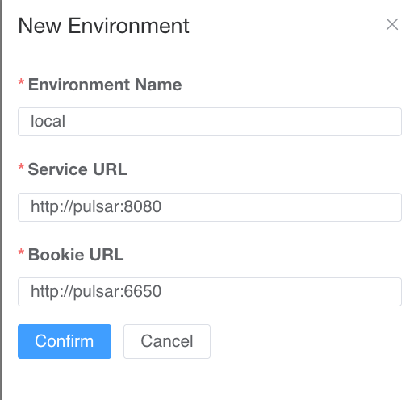

# demo-debezium-pulsar

Login for pulsar-manager is at `http://localhost:9527/`

Username: `admin`

Password: `apachepulsar`

Create a new environment with the following confio

Environment name: `local`

Service URL: `http://pulsar:8080`

Bookie URL: `http://pulsar:6650`

More instruction to configure can be found here
https://github.com/apache/pulsar-manager/tree/master?tab=readme-ov-file#configure-environment
